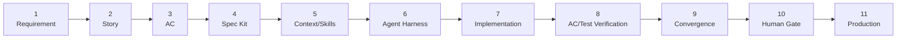

# Pipeline Stages — CircleCI Hello World Kiro Spec Demo

This document describes all 11 phases of the Kiro spec-driven development pipeline as demonstrated by this project. Each phase produces a concrete, traceable artifact. Phases 1–4 are complete spec artifacts; Phases 5–11 are active code phases.

---

## Pipeline Flowchart

---

## Phase 1 — Requirement ✅ Complete (artifact exists)

**File/Folder:** `.kiro/specs/circleci-hello-world-demo/requirements.md`

**Requirement IDs Satisfied:** All (source of truth)

In Phase 1, the team author the foundational requirements document. This is the single source of truth for all subsequent phases. Requirements are written in structured prose with numbered acceptance criteria so that every deliverable can be traced back to a specific requirement ID. For this project, requirements cover the HelloWorld class (Req 1), the entry point (Req 2), Composer configuration (Req 3), the PHPUnit test suite (Req 4), the CircleCI pipeline (Req 5), and the README (Req 6).

---

## Phase 2 — Story ✅ Complete (artifact exists)

**File/Folder:** User stories within `.kiro/specs/circleci-hello-world-demo/requirements.md`

**Requirement IDs Satisfied:** All (narrative layer)

Phase 2 translates raw requirements into user stories using the "As a developer, I want…, so that…" format. Each story captures the human motivation behind a requirement, making it easier for agents and reviewers to understand *why* a feature exists, not just *what* it must do. The stories in this project are all developer-centric since the primary audience is the development team consuming the CI pipeline.

---

## Phase 3 — Acceptance Criteria ✅ Complete (artifact exists)

**File/Folder:** Acceptance criteria within `.kiro/specs/circleci-hello-world-demo/requirements.md`

**Requirement IDs Satisfied:** All (testable conditions)

Phase 3 produces numbered, machine-verifiable acceptance criteria for each requirement. Each criterion is written in SHALL/WHEN/IF language and maps directly to a test assertion. This strict format ensures there is no ambiguity about what "done" means. The acceptance criteria for this project are numbered 1.1–6.3 and cover class methods, output format, Composer configuration, test structure, CI pipeline steps, and documentation content.

---

## Phase 4 — Spec Kit ✅ Complete (artifact exists)

**File/Folder:** `.kiro/specs/circleci-hello-world-demo/design.md`

**Requirement IDs Satisfied:** All (architecture decisions)

Phase 4 produces the design document: a technical blueprint derived from the requirements and acceptance criteria. It defines the component architecture, class interfaces, data models, error handling strategy, and correctness properties. For this project, the design document specifies the `App\HelloWorld` class API, the `index.php` bootstrap pattern, the `composer.json` structure, the PHPUnit test structure, and the CircleCI pipeline step ordering and rationale. It also formally states the two correctness properties (Property 1 and Property 2) that guide the convergence test phase.

---

## Phase 5 — Context/Skills 🔨 Active code phase

**File/Folder:** `.kiro/steering/project-context.md`

**Requirement IDs Satisfied:** N/A — documentation artifact

Phase 5 creates the agent steering context: a document that grounds all subsequent implementation decisions. It describes the project purpose, the 11-phase pipeline with phase-to-file mapping, the full planned folder layout, coding conventions (strict types, PSR-4 namespacing, PHPUnit 10), and the invariant properties the agent must preserve. This file is loaded at task-execution time by Kiro, ensuring the agent always operates with full awareness of the project's constraints before writing any code.

---

## Phase 6 — Agent Harness 🔨 Active code phase

**File/Folder:** `.circleci/config.yml`

**Requirement IDs Satisfied:** 5.1, 5.2, 5.3, 5.4, 5.5, 5.6, 5.7, 5.8, 5.9, 5.10

Phase 6 defines the CI pipeline that automates validation on every push. The pipeline is written in CircleCI 2.1 YAML with a named executor (`php-executor` using `cimg/php:8.2`), a single `build` job, and a `main` workflow with no branch filter. The seven steps execute in a carefully ordered sequence: checkout → composer install → PHP syntax lint → application smoke test → unit tests → convergence tests → human gate. Each step has a descriptive `name` field for readable CircleCI UI output. The ordering ensures fast-feedback failures surface at the earliest possible step.

---

## Phase 7 — Implementation 🔨 Active code phase

**File/Folder:** `src/HelloWorld.php`, `composer.json`, `index.php`

**Requirement IDs Satisfied:** 1.1, 1.2, 1.3, 1.4, 1.5, 2.1, 2.2, 2.3, 3.1, 3.2, 3.3

Phase 7 is the core implementation phase. Three files are created or updated: `composer.json` declares the PHP ≥ 8.2 platform requirement and `phpunit/phpunit: ^10.0` as a dev dependency, with PSR-4 autoloading mapping `App\` to `src/`; `src/HelloWorld.php` implements the `App\HelloWorld` class with three public methods (`getMessage()`, `getAppName()`, `run()`), all guarded by `declare(strict_types=1)`; and `index.php` is refactored from a flat script into a two-line bootstrap that requires the Composer autoloader and delegates all output to `HelloWorld::run()`. No business logic remains in the entry point.

---

## Phase 8 — AC/Test Verification 🔨 Active code phase

**File/Folder:** `tests/unit/HelloWorldTest.php`, `.kiro/hooks/ac-verification.json`

**Requirement IDs Satisfied:** 4.1, 4.2, 4.3, 4.4, 4.5

Phase 8 produces the acceptance criterion verification layer. The unit test file at `tests/unit/HelloWorldTest.php` extends `PHPUnit\Framework\TestCase` and contains three test methods — `testGetMessage()`, `testGetAppName()`, and `testRun()` — each mapped directly to a numbered acceptance criterion. The `testRun()` method uses PHP output buffering (`ob_start` / `ob_get_clean`) to capture stdout and asserts all three required substrings are present. A Kiro hook (`ac-verification.json`) fires on every PHP file save during local development, automatically re-running the unit suite and surfacing failures immediately without requiring a manual terminal command.

---

## Phase 9 — Convergence 🔨 Active code phase

**File/Folder:** `tests/convergence/ConvergenceTest.php`

**Requirement IDs Satisfied:** 1.4, 1.5, 2.2, 2.3

Phase 9 creates a dedicated convergence test suite that validates universal invariants rather than specific examples. While Phase 8 unit tests verify "does this specific input produce this specific output?", Phase 9 convergence tests answer "does this structural property hold across ALL valid executions?". Two properties are verified: Property 1 asserts that `run()` always contains all three required output substrings (invariant regardless of PHP version); Property 2 asserts that `HelloWorld::run()` produces identical output on every invocation, which — combined with the fact that `index.php` only calls `run()` — proves the entry point cannot introduce extra output. This phase exists as a distinct pipeline stage to demonstrate the conceptual separation between example-based and property-based testing.

---

## Phase 10 — Human Gate 🔨 Active code phase

**File/Folder:** `scripts/human-gate.sh`

**Requirement IDs Satisfied:** 5.8 (maps to the final CI pipeline step)

Phase 10 introduces a programmable pre-production gate. The `scripts/human-gate.sh` shell script runs both the unit test suite and the convergence test suite sequentially. If either suite fails, it prints `[HUMAN GATE] Tests failed — pipeline blocked.` to stderr and exits with code 1, halting the CI job. If both suites pass, it prints a success banner and exits with code 0. The script can be run locally before a push or invoked as the final step in the CircleCI pipeline. It serves as a checkpoint — named "Human Gate" — where a human reviewer can see a clear pass/fail signal before any code reaches production.

---

## Phase 11 — Production 🔨 Active code phase

**File/Folder:** `README.md`, `docs/pipeline-stages.md`

**Requirement IDs Satisfied:** 6.1, 6.2, 6.3

Phase 11 is the production artifact phase. `README.md` is updated with a CircleCI build status badge (linking to the project's pipeline), a project description referencing the 11-phase pipeline, prerequisites, and complete local setup instructions for all five commands (`composer install`, `php index.php`, unit tests, convergence tests, and the human gate script). No Travis CI references appear. `docs/pipeline-stages.md` (this file) provides the narrative documentation: a Mermaid flowchart of the full pipeline followed by a per-phase description covering purpose, artifact, and requirement IDs satisfied. Together, these two documents complete the project's public-facing record of its own construction.
